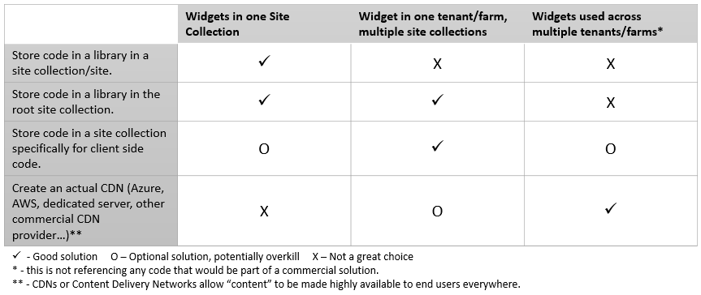

---
title: Future-Proof Client-Side SharePoint Customizations
audience: Developer, Administrator, Architect, Security Administrator
product-major: SharePoint
product-minor: NA
glossary-links: SharePoint Framework (SPFx)
---
# Future-Proof client-side SharePoint customizations

# Summary
Future-Proof client-side development processess to utilize a development toolchain that formalizes the development of client-side solutions from copy/paste/run to more rigerous development standards.
 
# Main Content
Client-side development is code that runs in the client's browser instead of on the server. In genreal client-side code means [ECMAScript](https://en.wikipedia.org/wiki/ECMAScript) and in particular the "implementation" of ECMAScript, JavaScript. As browsers become more powerful offloading and customizng solutions that run in the browser gives the user a better user experience that is more fluid and tailored to the task and because of this has become more and more propular.  

JavaScript in particular has a fairly low entry point and although that can empower users to build quick solutions to common problems it can also lead to implementation of potentially harmful script.  Further, as an organization upgrades and/or modernizes it's impelentation the sprawl of client-side solutions can become hard to manage and a barrier for progress.  In recent times the online version of Office365 has formalized by creating a deployment model that supports implementing client-side solutions within the ecosystem in the form of the SharePoint Framework (SPFx). By doing so, organizations have gained that formaized development and deployment however, not all environments have moved to Office 365 and there is need to have a similar approch for solutions on previous versions of the SharePoint on premesis product. A mature organization would create a governance model that addresses the following principals:

1. Have a catalog of client side implementations
1. Provides development standards for solutions
1. Provides deployment guidelines and addresses CDN considerations
1. Provides governance around 3rd party libraries
1. If appropriate, addresses managing multi-lingual implementations 
 
## Catalog of Client Side Implementations
A catalog of solutions can be managed as simply as a central registry maintained manually by one person, this might be a document in a SharePoint library or a SharePoint list. This could also be accomplished by leveraging the deployment guidelines you might implement which could then grow a catalog organically.

## Development Standards
By creating a standard project template for any client side solutions no matter how basic you can ensure that various development standards that are important to your organization have been addressed.  Things like testing, linting, bundling, minifiying, uglifying, and/or the use of TypeScript vs plain JavaScript can be controlled through this means.

## Deployment Guidelines and CDN Useage
Based on how large your SharePoint implementation is you should consider the idea of centralizing your code solutions. Depending on the size of your organization and your SharePoint implementation this can vary. If we consider all customizations to be "widgets" then you can consider the following guidance

## Third-Party JavaScript Library Usage
//TODO: Security considerations??

## Multi-Lingual Considerations

//TODO: Bob German's blog post.
